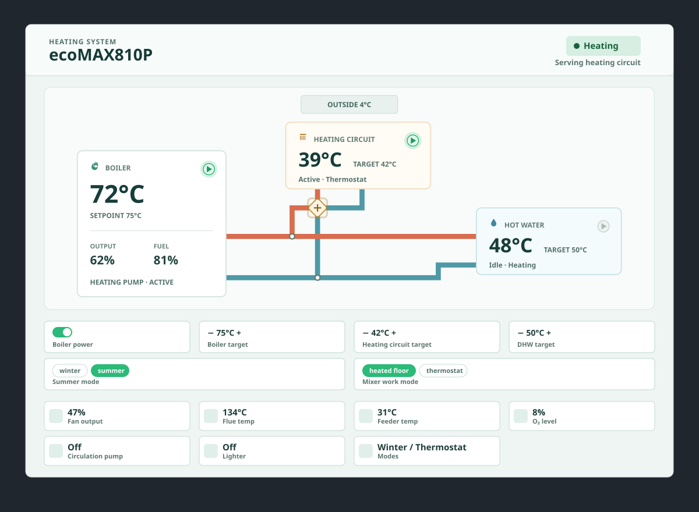

# ecoMAX810P Diagram Card (Home Assistant Lovelace)

A custom Lovelace card that visualizes a **Plum ecoMAX 810P-L Touch** boiler, heating circuit, and domestic hot water system in a single status-driven diagram.



## Install (HACS)

1. HACS → **Frontend**
2. **Custom repositories**
3. Add this repository URL and select category **Lovelace**
4. Install **ecoMAX810P Diagram Card**
5. Restart Home Assistant (recommended)
6. Ensure the resource is added (HACS usually does this automatically):
   - `/hacsfiles/ecomax810p-diagram-card/ecomax810p-diagram-card.js`

If it’s not added automatically, add it manually in **Settings → Dashboards → Resources** as a **module**.

If you don’t see updates after upgrading:
- Remove any old resource entries (especially ones pointing to `dist/...`)
- Hard-refresh the browser (or clear site data for your Home Assistant URL)
- As a last resort, add a cache-buster to the resource URL, e.g. `.../ecomax810p-diagram-card.js?v=1`

## Usage

Add a manual card (or use the visual editor):

```yaml
type: custom:ecomax810p-diagram-card
title: ecoMAX810P
layout: auto
breakpoint: 700
theme: auto
show_diagnostics: true
extra_tiles:
  - entity: sensor.ecomax_810p_l_touch_connected_modules
    label: Modules
    icon: alert
    format: raw
entities:
  state: sensor.ecomax_810p_l_touch_state
  alert: binary_sensor.ecomax_810p_l_touch_alert
  connection_status: binary_sensor.ecomax_810p_l_touch_connection_status
  outside_temperature: sensor.ecomax_810p_l_touch_outside_temperature

  boiler_switch: switch.ecomax_810p_l_touch_controller_switch
  boiler_target_temperature_control: number.ecomax_810p_l_touch_target_heating_temperature
  mixer_target_temperature_control: number.ecomax_810p_l_touch_mixer_1_target_mixer_temperature

  boiler_load: sensor.ecomax_810p_l_touch_boiler_load
  fuel_level: sensor.ecomax_810p_l_touch_fuel_level
  fan_power: sensor.ecomax_810p_l_touch_fan_power

  boiler_temperature: sensor.ecomax_810p_l_touch_heating_temperature
  boiler_target_temperature: sensor.ecomax_810p_l_touch_heating_target_temperature

  mixer_temperature: sensor.ecomax_810p_l_touch_mixer_1_mixer_temperature
  mixer_target_temperature: sensor.ecomax_810p_l_touch_mixer_1_mixer_target_temperature

  dhw_temperature: sensor.ecomax_810p_l_touch_water_heater_temperature
  dhw_target_temperature: sensor.ecomax_810p_l_touch_water_heater_target_temperature
  dhw_electric_heater: switch.your_dhw_electric_heater

  exhaust_temperature: sensor.ecomax_810p_l_touch_exhaust_temperature
  feeder_temperature: sensor.ecomax_810p_l_touch_feeder_temperature
  oxygen_level: sensor.ecomax_810p_l_touch_oxygen_level

  summer_mode: select.ecomax_810p_l_touch_summer_mode
  mixer_work_mode: select.ecomax_810p_l_touch_mixer_1_work_mode
  water_heater: water_heater.ecomax_810p_l_touch_indirect_water_heater

  heating_pump_running: binary_sensor.ecomax_810p_l_touch_heating_pump
  dhw_pump_running: binary_sensor.ecomax_810p_l_touch_water_heater_pump
  mixer_pump_running: binary_sensor.ecomax_810p_l_touch_mixer_1_mixer_pump

  circulation_pump_running: binary_sensor.ecomax_810p_l_touch_circulation_pump
  fan_running: binary_sensor.ecomax_810p_l_touch_fan
  exhaust_fan_running: binary_sensor.ecomax_810p_l_touch_exhaust_fan
  feeder_running: binary_sensor.ecomax_810p_l_touch_feeder
  lighter_running: binary_sensor.ecomax_810p_l_touch_lighter
```

### Config options

- `title` (optional): card title
- `layout` (optional, default `auto`): `auto` | `mobile` | `desktop`
- `breakpoint` (optional, default `700`): width in px used for `layout: auto`
- `theme` (optional, default `auto`): `auto` | `light` | `dark`. `auto` follows Home Assistant's active light/dark mode; `light`/`dark` force the card's appearance regardless of the dashboard theme.
- `show_diagnostics` (optional, default `true`): show the secondary diagnostics grid (fan output, flue/feeder temperature, O₂ level, circulation pump, lighter, operating modes). Primary values (boiler/heating/DHW temperatures, boiler load, fuel level, outdoor temperature) always appear once, on the system diagram.
- `show_controls` (optional, default `true`): show interactive controls for any of the writable entities below that you've mapped. Controls for entities you haven't mapped are simply omitted.
- `show_animations` (optional, default `true`): subtle motion — flowing pipes while a circuit is pumping, a gentle glow pulse on the pump/fan indicator while active, a pulse on an active status pill, and a brief highlight when a displayed value changes. Set to `false` for a fully static card. Respects the browser's "reduce motion" accessibility setting either way.
- `disabled_diagnostics` (optional): array hiding specific built-in diagnostics tiles without turning off the whole grid. Values: `fan_power`, `exhaust_temperature`, `feeder_temperature`, `oxygen_level`, `circulation_pump_running`, `lighter_running`, `summer_mode`, `mixer_work_mode`. The `summer_mode`/`mixer_work_mode` entries here only hide the read-only sensor tile — see `disabled_controls` for their control.
- `disabled_controls` (optional): array hiding specific interactive controls without turning off `show_controls` entirely. Values: `boiler_switch`, `boiler_target_temperature_control`, `mixer_target_temperature_control`, `water_heater`, `summer_mode`, `mixer_work_mode`. This lets you show a mode as a sensor without exposing a control for it, or vice versa.
- `extra_tiles` (optional): list of additional diagnostic tiles. Each item supports `entity`, optional `label`, optional `icon` (`thermo|fire|fan|pump|alert`), and optional `format` (`auto|raw|temp|pct|onoff`).
- `entities` (required): mapping of your ecoMAX entities (see example above). `connection_status` is optional — map it to your device's connectivity `binary_sensor` to show an "Offline" status when the controller is unreachable, instead of just "Off". `dhw_electric_heater` is optional — map it to any `switch` entity (e.g. a smart plug) that controls an electric heating element inside the DHW tank; this is not part of the ecoMAX controller itself, it's shown as a separate indicator on the DHW box.

By default (`theme: auto`) the card follows the active Home Assistant light/dark mode. Set `theme: dark` or `theme: light` to override it.

Sensor values shown on the card (on the system diagram and in the diagnostics grid) are clickable and open Home Assistant's standard history/more-info dialog for that entity, just like other cards. Interactive controls (switches, steppers, mode chips) are not clickable for history since they're already used to change the entity.

## Controls

Add any of these optional entity mappings to enable an interactive control on the card. Each control only appears when its entity is mapped:

- `boiler_switch`: a `switch` entity that turns the boiler controller on/off → shows a power toggle.
- `boiler_target_temperature_control`: the writable `number` entity for the boiler's target heating temperature (e.g. `number.ecomax_810p_l_touch_target_heating_temperature`) → shows a −/+ stepper.
- `mixer_target_temperature_control`: the writable `number` entity for the heating circuit's target temperature (e.g. `number.ecomax_810p_l_touch_mixer_1_target_mixer_temperature`) → shows a −/+ stepper.
- `water_heater`: the same `water_heater` entity already used for display also gets a −/+ target-temperature stepper.
- `summer_mode` / `mixer_work_mode`: the same `select` entities already used for display also get a tap-to-select control, one button per available option.

## Development

- Source: `src/` (TypeScript)
- Built artifact committed for HACS: `ecomax810p-diagram-card.js`
- Run `npm install`, `npm run check`, and `npm run build` before submitting a change. Commit the regenerated root bundle with source changes.
- Build tooling is included (`rollup.config.mjs`), but Home Assistant only needs the root card file.
- The card version (visible in the browser console and card metadata) is injected at build time from the `version` field in `package.json` — there is no separate version to edit by hand.

## Releases

Releases are fully automated from `package.json`:

1. Bump the `version` field in `package.json` and merge to `main`.
2. The `Release` workflow reads that version, and if a `vX.Y.Z` tag for it doesn't already exist yet, it builds the card, creates the tag, and publishes a GitHub release with the built `ecomax810p-diagram-card.js` attached.
3. If the version on `main` was already released, the workflow is a no-op — pushing to `main` without bumping the version does not create duplicate releases.

No manual tagging or manual release-triggering is required.


